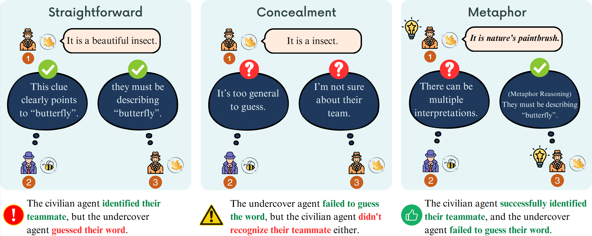
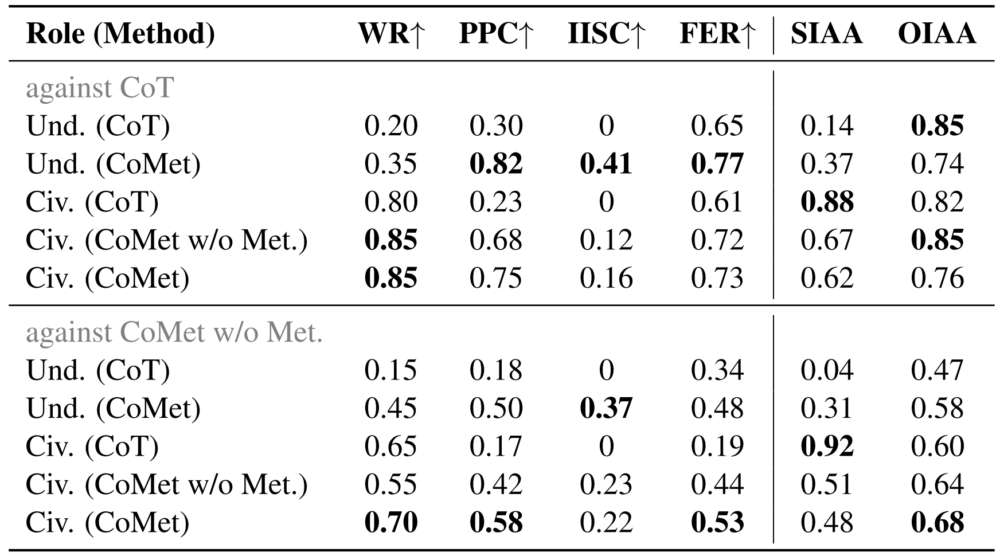
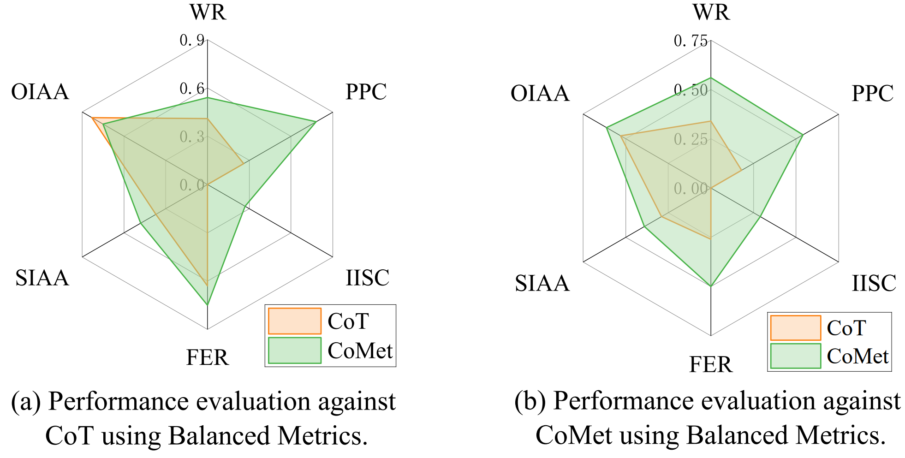

# CoMet: Conversational Metaphor Chain for Social Deduction Games


CoMet is a social deduction game framework based on large language models, focusing on the role of metaphorical thinking chains in game dialogue. This project implements a complete AI system for the "Who Is Undercover" game, supporting multiple reasoning modes, particularly cognitive reasoning mechanisms based on metaphors.


You can check our paper [here](https://aclanthology.org/2025.acl-long.389/).


## 📁 Project Structure

```
CoMet/
│
├── gamelist/
│   └── WhoIsUndercover/
│   ├── game.py              # Game engine and state management
│   ├── player.py            # Player AI and multi-reasoning mode implementation
│   ├── experience_manager.py # Metaphor experience pool management
│   ├── prompt/              # Multi-level dialogue prompt templates
│   │   ├── base_prompt.py   # Basic prompt templates
│   │   ├── CoMet.py         # CoMet-specific prompts
│   │   └── metaphor_prompt.py # Metaphor analysis prompts
│   └── words/               # Game word bank configuration
│
├── data/
│   └── WhoIsUndercover/
│       └── experience_pool.json # Metaphor experience database
│
├── logs/                    # Game logs
├── config.py               # Configuration parameter management
├── main.py                 # Main program entry
├── utils.py                # API calling utilities
├── requirements.txt        
└── README.md              
```

## 🚀 Quick Start

### 1. Environment Setup

```bash
pip install -r requirements.txt
```

### 2. API Configuration

Improve the interfaces within `utils.py` - implement large model calls through your own LLM API.

### 3. Run Game

```bash
python main.py
```

## 🧠 CoMet Architecture Details

### FISA Four-Stage Reasoning Model

1. **Feature Analysis** - Feature extraction and analysis
   - Analyze core features and attributes of words
   - Identify descriptive keywords

2. **Identity Reasoning** - Identity reasoning and faction division
   - Reason other players' identities based on their speech
   - Dynamically update teammate/opponent judgments

3. **Strategy Selection** - Strategy formulation
   - Select optimal strategies based on role and game state
   - Civilian: identify undercover vs Undercover: hide identity

4. **Action Implementation** - Action execution
   - Generate speech content that aligns with strategy
   - Vote based on reasoning results

### Metaphor System

#### Three Metaphor Types
- **Ontological Metaphor**: Entity representation of abstract concepts
- **Structural Metaphor**: Understanding complex concepts through familiar structures
- **Spatial Metaphor**: Mapping abstract experiences through spatial relationships

#### Metaphor Evaluation Mechanism
- **Teammate Recognition**: Whether teammates can understand metaphorical expressions
- **Opponent Interference**: Whether opponents can guess answers through metaphors
- **Comprehensive Scoring**: Success rate calculation based on usage effects

## 📊 Experience Management System

### Experience Pool Functions
- **Historical Records**: Save all metaphor usage cases and effects
- **Intelligent Retrieval**: Categorized management by success rate, type, usage frequency
- **Adaptive Optimization**: Dynamically adjust weights based on game outcomes

### Evaluation Dimensions
```json
{
  "id": "unique_identifier",
  "words": ["word1", "word2"],
  "metaphor": "metaphorical_expression",
  "method": "ONTOLOGICAL_METAPHOR",
  "teammate_recognitions": 1,  // Teammate recognition count
  "rival_recognitions": 0,      // Opponent recognition count
  "use": 0,                     // 0=success, 1=failure
  "score": 0.85                 // Success rate score
}
```

## 🎮 Game Flow

1. **Role Assignment**: System randomly assigns civilian and undercover roles
2. **Word Distribution**: Civilians receive the same word, undercovers receive similar words
3. **Speaking Phase**: Players take turns describing their words (metaphors allowed)
4. **Voting Phase**: Vote to eliminate suspicious players based on speech content
5. **Victory Determination**:
   - Civilian Victory: Eliminate all undercovers
   - Undercover Victory: Undercover count >= Civilian count


## 💾 Results
The following content shows the experimental results of our work. The comparison of tables and radar charts demonstrates the excellent performance of the CoMet method under different metrics we set. For details, please read the article.



Performance comparison of different methods relative to two baselines in Undercover game.
<br>
<br>
<br>


Evaluation of the comprehensive performance of CoT and CoMet agents in Undercover game using balanced metrics.
<br>
<br>
<br>


## 💫


## 🌍️Related Work (Benchmark for Undercover)

We recommend you use our follow-up work [CK-Arena](https://CK-Arena.site) to conduct research on Undercover games. This is our LLM testing benchmark designed based on Undercover, which includes better game logic, anti-crash mechanisms, and prompts. We are still working on the follow-up work of undercover, mainly updating it on the CK-Arena homepage.

## 📄 Citement

If CoMet is helpful to your research, please cite our paper:

```bibtex
@inproceedings{xu-zhong-2025-comet,
    title = "{C}o{M}et: Metaphor-Driven Covert Communication for Multi-Agent Language Games",
    author = "Xu, Shuhang  and
      Zhong, Fangwei",
    booktitle = "Proceedings of the 63rd Annual Meeting of the Association for Computational Linguistics (Volume 1: Long Papers)",
    month = jul,
    year = "2025",
    doi = "10.18653/v1/2025.acl-long.389",
    pages = "7892--7917"
}

```


